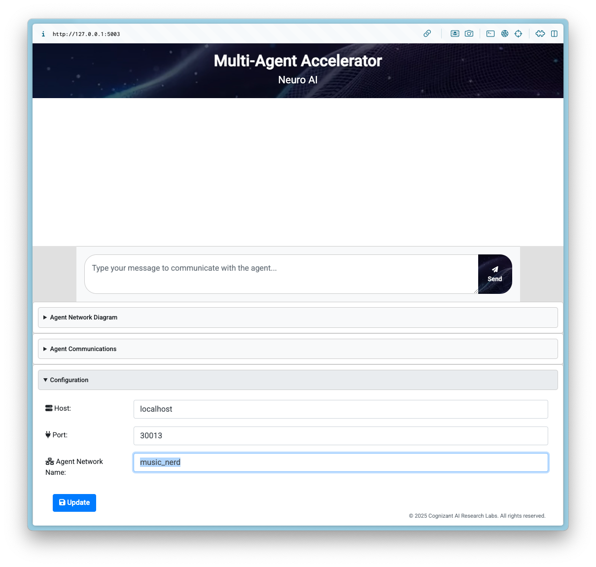

# Demos for the neuro-san library

This repository contains a collection of demos for the [neuro-san library](https://github.com/leaf-ai/neuro-san).
They should help developers get started with the library and understand how to create their own agent networks.

---

## Installation

Clone the repo:

```bash
git clone https://github.com/leaf-ai/neuro-san-demos
```

Go to dir:

```bash
cd neuro-san-demos
```

Ensure you have a supported version of python (3.12 at this time):

```bash
python --version
```

Create a dedicated Python virtual environment:

```bash
python -m venv venv
```

Source it:

- For Windows:

  ```bash
  .\venv\Scripts\activate && export PYTHONPATH=`pwd`
  ```

- For Mac:

  ```bash
  source venv/bin/activate && export PYTHONPATH=`pwd`
  ```

Install the requirements:

```bash
pip install -r requirements.txt
```

**IMPORTANT**: By default the server relies on OpenAI's `gpt-4o` model. Set the OpenAI API key, and add it to your shell configuration so it's available in future sessions.

You can get your OpenAI API key from <https://platform.openai.com/signup>. After signing up, create a new API key in the API keys section in your profile.

**NOTE**: Replace `XXX` with your actual OpenAI API key.  
**NOTE**: This is OS dependent.

- For macOS and Linux:

  ```bash
  export OPENAI_API_KEY="XXX" && echo 'export OPENAI_API_KEY="XXX"' >> ~/.zshrc
  ```

- For Windows:
  - On Command Prompt:

    ```bash
    set OPENAI_API_KEY=XXX
    ```

  - On PowerShell:

    ```bash
    $env:OPENAI_API_KEY="XXX"
    ```

Other providers and models are supported too but will require proper setup.

## Run

There are multiple ways in which we can now use the neuro-san server with a client:

### Option 1: Using a basic web client interface

A [basic web client interface](https://github.com/leaf-ai/neuro-san-web-client) is installed by default.
It's a great, simple example of how to connect to a neuro-san server and interact with it.
Start the server and the client in one single command:

```bash
python -m run
```

The client and server logs will show on the screen,
and will also be saved to `logs/server.log` and `logs/client.log` respectively.
As a default, on a web browser you can now navigate to <http://127.0.0.1:5003/> to start using the application:



1. Expand the `Configuration` tab at the bottom of the interface
2. Choose an Agent Network Name, e.g. "music_nerd", click Update  
   💡 **Hint**: Check the server logs to see which agent networks are available. For instance:

   ```text
   SERVER: {"message": "tool_registries found: ['hello_world', 'airline_policy', 'advanced_calculator', 'smart_home', 'smart_home_onf', 'agent_network_designer', 'agent_network_generator', 'music_nerd', 'music_nerd_pro', 'agentforce', 'banking_ops', 'cpg_agents', 'insurance_agents', 'intranet_agents', 'retail_ops_and_customer_service', 'six_thinking_hats', 'telco_network_support']", "user_id": "None", "Timestamp": "2025-04-11T11:20:22.092078", "source": "Agent Server", "message_type": "Other", "request_id": "None"}
   ```

   They should match the list of agent networks that are activated in the `registries/manifest.hocon` file.
3. Type your message in the chat box and press 'Send' to interact with the agent network.
4. Optional: open the `Agent Network Diagram` tab to visualize the interactions between the agents.
5. Optional: open the `Agent Communications` tab to see the messages exchanged between the agents.

Run this command to see the various config options for the server and client:

```bash
python -m run --help
```

---

### Option 2: Using [`nsflow`](https://github.com/leaf-ai/nsflow) as a developer-oriented web client

If you want to use neuro-san with a FastAPI-based developer-oriented client, follow these steps:

- Start the Backend & Frontend, from project root:

  ```bash
  python -m nsflow.run
  ```

By default:

- Frontend will be available at: `http://127.0.0.1:4173`
- OpenAPI specs will be available at: `http://127.0.0.1:4173/docs`

To see the various config options for this app, on terminal

```bash
python -m nsflow.run --help
```

Screenshot:


---

### Option 3: Command Line Interface

You can also use [neuro-san](https://github.com/leaf-ai/neuro-san)'s command line interface (CLI) to start and interact with the server.

- Export the following environment variables:

  ```bash
  # Point the server to the manifest file containing the agent network configurations
  export AGENT_MANIFEST_FILE="./registries/manifest.hocon"
  # Point the server to the directory containing the agent Python tools
  export AGENT_TOOL_PATH="./coded_tools"
  ```

- Start the server:

```bash
python -m neuro_san.service.agent_main_loop --port 30011
```

- Start the client:
  From another terminal window, navigate to the repo's folder and activate the virtual environment:

  ```bash
  source venv/bin/activate && export PYTHONPATH=`pwd`
  ```

Then start the client:

```bash
python -m neuro_san.client.agent_cli --connection service --agent hello_world
```

- Query the client:
  
  When prompted, ask a question to the `hello_world` agent network. For example:

  ```text
  I am travelling to a new planet and wish to send greetings to the orb.
  ```

And it should return something like:

```text
Hello, world.
```

... but you are dealing with LLMs. Your results will vary!

Type `quit` to exit the client.

---

## User guide

Ready to dive in? Check out the [user guide](docs/user_guide.md) for a detailed overview of the neuro-san library
and its features.

---

## Tutorial

For a detailed tutorial, refer to [docs/tutorial.md](docs/tutorial.md).

---

## Examples

For examples of agent networks, check out [docs/examples.md](docs/examples.md).

---

## Developer Guide

For the development guide, check out [docs/dev_guide.md](docs/dev_guide.md).
