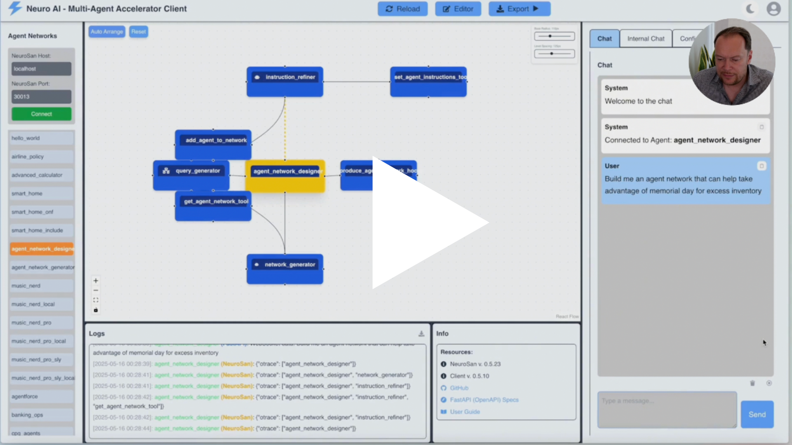
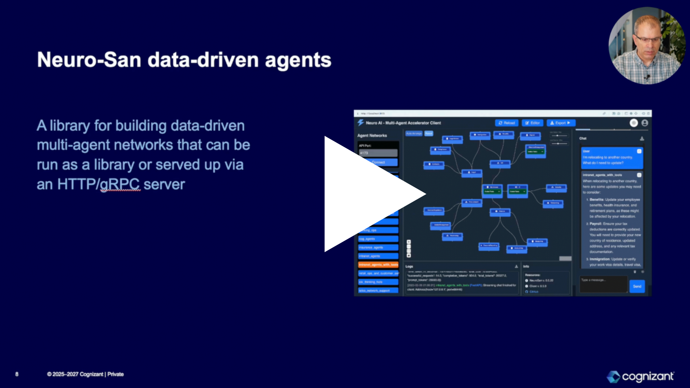
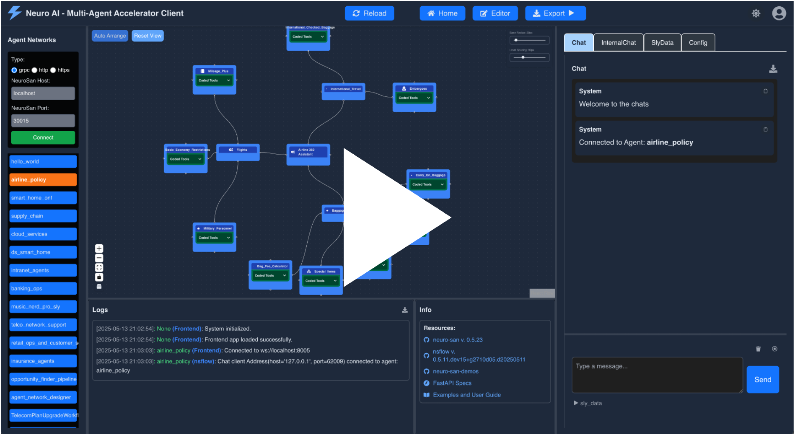

<h2 align="center">Neuro SAN Studio</h2>
<p align="center">
  A playground for <a href="https://github.com/cognizant-ai-lab/neuro-san">Neuro SAN</a> - this repo includes working examples to get started, explore, extend, and experiment with custom multi-agent networks!
</p>

---

<p align="center">
  Neuro SAN is the open-source library powering the Cognizant Neuro® AI Multi-Agent Accelerator, allowing domain experts, researchers and developers to immediately start prototyping and building agent networks across any industry vertical.
</p>

---

<p align="center">
  <!-- GitHub Stats -->
  
  
  
</p>
<p align="center">
  <!-- Github Info -->
  
  
  
</p>

<p align="center">
  <!-- Neuro SAN Stats -->
  Neuro SAN library <br>
  <a href="https://github.com/cognizant-ai-lab/neuro-san"></a>
  
  <a href="https://pepy.tech/projects/neuro-san"></a>
  <a href="https://pypi.org/project/neuro-san/"></a>
</p>


## What is Neuro SAN?

[**Neuro AI system of agent networks (Neuro SAN)**](https://github.com/cognizant-ai-lab/neuro-san) is an open-source, data-driven multi-agent orchestration framework designed to simplify and accelerate the development of collaborative AI systems. It allows users—from machine learning engineers to business domain experts—to quickly build sophisticated multi-agent applications without extensive coding, using declarative configuration files (in HOCON format).

Neuro SAN enables multiple large language model (LLM)-powered agents to collaboratively solve complex tasks, dynamically delegating subtasks through adaptive inter-agent communication protocols. This approach addresses the limitations inherent to single-agent systems, where no single model has all the expertise or context necessary for multifaceted problems.

| Build a multi-agent network in minutes                                              | Neuro SAN overview                                                                     | Quick start                                                              |
|-------------------------------------------------------------------------------------|----------------------------------------------------------------------------------------|--------------------------------------------------------------------------|
| [](https://www.youtube.com/watch?v=wGxvPBN34Mk) | [](https://www.youtube.com/watch?v=NmniQWQT6vI) | [](https://youtu.be/gfem8ylphWA) |

---

### ✨ Key Features

* **🗂️ Data-Driven Configuration**: Entire agent networks are defined declaratively via simple HOCON files, empowering technical and non-technical stakeholders to design agent interactions intuitively.
* **🔀 Adaptive Communication ([AAOSA Protocol](https://arxiv.org/abs/cs/9812015))**: Agents autonomously determine how to delegate tasks, making interactions fluid and dynamic with decentralized decison making.
* **🔒 Sly-Data**: Sly Data facilitates safe handling and transfer of sensitive data between agents without exposing it directly to any language models.
* **🧩 Dynamic Agent Network Designer**: Includes a meta-agent called the Agent Network Designer – essentially, an agent that creates other agent networks. Provided as an example with Neuro SAN, it can take a high-level description of a use-case as input and generate a new custom agent network for it.
* **🛠️ Flexible Tool Integration**: Integrate custom Python-based "coded tools," APIs, databases, and even external agent ecosystems (Agentforce, Agentspace, CrewAI, MCP, A2A agents, LangChain tools and more) seamlessly into your agent workflows.
* **📈 Robust Traceability**: Detailed logging, tracing, and session-level metrics enhance transparency, debugging, and operational monitoring.
* **🌐 Extensible and Cloud-Agnostic**: Compatible with a wide variety of LLM providers (OpenAI, Anthropic, Azure, Ollama, etc.) and deployable in diverse environments (local machines, containers, or cloud infrastructures).

---

### Use Cases:
A number of examples that can be built using Neuro SAN:
<table>
  <thead>
    <tr>
      <th>Agent Network</th>
      <th>Use-Case</th>
      <th>Description</th>
    </tr>
  </thead>
  <tbody>
    <tr>
      <td>🧬 <strong>Agent Network Designer</strong></td>
      <td>Automated generation of multi-agent HOCON configurations.</td>
      <td>Generates complex multi-agent configurations from natural language input, simplifying the creation of intricate agent workflows.</td>
    </tr>
    <tr>
      <td>🛫 <strong>Airline Policy Assistance</strong></td>
      <td>Customer support for airline policies.</td>
      <td>Agents interpret and explain airline policies, assisting customers with inquiries about baggage allowances, cancellations, and travel-related concerns.</td>
    </tr>
    <tr>
      <td>🏦 <strong>Banking Operations & Compliance</strong></td>
      <td>Automated financial operations and regulatory compliance.</td>
      <td>Automates tasks such as transaction monitoring, fraud detection, and compliance reporting, ensuring adherence to regulations and efficient routine operations.</td>
    </tr>
    <tr>
      <td>🛍️ <strong>Consumer Packaged Goods (CPG)</strong></td>
      <td>Market analysis and product development in CPG.</td>
      <td>Gathers and analyzes market trends, customer feedback, and sales data to support product development and strategic marketing.</td>
    </tr>
    <tr>
      <td>🛡️ <strong>Insurance Agents</strong></td>
      <td>Claims processing and risk assessment.</td>
      <td>Automates claims evaluation, assesses risk factors, ensures policy compliance, and improves claim-handling efficiency and customer satisfaction.</td>
    </tr>
    <tr>
      <td>🏢 <strong>Intranet Agents</strong></td>
      <td>Internal knowledge management and employee support.</td>
      <td>Provides employees with quick access to policies, HR, and IT support, enhancing internal communications and resource accessibility.</td>
    </tr>
    <tr>
      <td>🛒 <strong>Retail Operations & Customer Service</strong></td>
      <td>Enhancing retail customer experience and operational efficiency.</td>
      <td>Handles customer inquiries, inventory management, and supports sales processes to optimize operations and service quality.</td>
    </tr>
    <tr>
      <td>🧠 <strong>Six Thinking Hats</strong></td>
      <td>Structured decision-making and brainstorming.</td>
      <td>Emulates Edward de Bono's methodology, assigning distinct perspectives (logical, emotional, creative) to specialized agents.</td>
    </tr>
    <tr>
      <td>🏠 <strong>Smart Home Management</strong></td>
      <td>Home automation and device control.</td>
      <td>Coordinates smart home devices, allowing users to control lighting, temperature, and security via natural language.</td>
    </tr>
    <tr>
      <td>📞 <strong>Telco Network Support</strong></td>
      <td>Technical support and network issue resolution.</td>
      <td>Diagnoses network problems, guides troubleshooting, and escalates complex issues, reducing downtime and enhancing customer service.</td>
    </tr>
    <tr>
      <td>📞 <strong>Therapy Vignette Supervision</strong></td>
      <td>Generates treatment plan for a given therapy vignette.</td>
      <td>A good example of using multiple different expert agents working together to come up with a single plan.</td>
    </tr>
    <tr>
      <td>📝 <strong>Kwik Memory Agent</strong></td>
      <td>Enhanced memory retention and retrieval.</td>
      <td>Improves agent capability in storing and recalling information, enhancing long-term contextual awareness.</td>
    </tr>
    <tr>
      <td>📄 <strong>PDF_RAG Agent</strong></td>
      <td>Retrieval-Augmented Generation from PDF documents.</td>
      <td>Processes and extracts accurate information from PDF files for analysis and summarization tasks.</td>
    </tr>
    <tr>
      <td>🚀 <strong>Agentforce Agent</strong></td>
      <td>Integration with Salesforce's AgentForce for enterprise workflows.</td>
      <td>Allows Neuro-SAN agents to interact with Salesforce AgentForce, automating customer relationship management processes.</td>
    </tr>
    <tr>
      <td>🔌 <strong>Agentspace Adapter</strong></td>
      <td>Connecting agents across different platforms.</td>
      <td>Acts as a communication bridge between Neuro-SAN and other agent ecosystems, enhancing interoperability.</td>
    </tr>
    <tr>
      <td>🤝 <strong>CrewAI Agent</strong></td>
      <td>Integration with CrewAI for collaborative tasks.</td>
      <td>Enables seamless coordination between Neuro-SAN agents and CrewAI, facilitating cross-framework collaboration.</td>
    </tr>
    <tr>
      <td>🧰 <strong>MCP Agent</strong></td>
      <td>Utilization of Model Context Protocol for tool integration.</td>
      <td>Integrates external tools and services into agent workflows, expanding capabilities using the Model Context Protocol.</td>
    </tr>
    <tr>
      <td>🔄 <strong>A2A based Agent</strong></td>
      <td>Agent-to-Agent communication via Google A2A protocol.</td>
      <td>Enables efficient, decentralized agent communication and task delegation using the A2A protocol.</td>
    </tr>
    <tr>
      <td>🔄 <strong>Conscious Agent</strong></td>
      <td>An example agent network that is run continuously via the conscious_assistant flask app.</td>
      <td>This is an example of how to run agents continuously, initiating them from code, and how to make tool calls to non-default packages.</td>
    </tr>
    <tr>
      <td colspan="3"><strong>And Many More...</strong></td>
    </tr>
  </tbody>
</table>

---

## High level Architecture:

<p align="left">
  
</p>

---

## Getting Started:

To dive into Neuro SAN and start building your own multi-agent networks, this repository contains a collection of demos for the [neuro-san library](https://github.com/cognizant-ai-lab/neuro-san).

You'll find comprehensive documentation, example agent networks, and tutorials to guide you through your first steps.

---

### Installation

Clone the repo:

```bash
git clone https://github.com/cognizant-ai-lab/neuro-san-studio
```

Go to dir:

```bash
cd neuro-san-studio
```

Ensure you have a supported version of python (3.12 at this time):

```bash
python --version
```

Create a dedicated Python virtual environment:

```bash
python -m venv venv
```

Source it:

- For Windows:

  ```bash
  .\venv\Scripts\activate && export PYTHONPATH=`pwd`
  ```

- For Mac:

  ```bash
  source venv/bin/activate && export PYTHONPATH=`pwd`
  ```

Install the requirements:

```bash
pip install -r requirements.txt
```

**IMPORTANT**: By default the server relies on OpenAI's `gpt-4o` model. Set the OpenAI API key, and add it to your shell configuration so it's available in future sessions.

You can get your OpenAI API key from <https://platform.openai.com/signup>. After signing up, create a new API key in the API keys section in your profile.

**NOTE**: Replace `XXX` with your actual OpenAI API key.  
**NOTE**: This is OS dependent.

- For macOS and Linux:

  ```bash
  export OPENAI_API_KEY="XXX" && echo 'export OPENAI_API_KEY="XXX"' >> ~/.zshrc
  ```

- For Windows:
  - On Command Prompt:

    ```bash
    set OPENAI_API_KEY=XXX
    ```

  - On PowerShell:

    ```bash
    $env:OPENAI_API_KEY="XXX"
    ```

Other providers and models are supported too but will require proper setup.

---

### Run

There are multiple ways in which we can now use the neuro-san server with a client:

#### Option 1: Using [`nsflow`](https://github.com/cognizant-ai-lab/nsflow) as a developer-oriented web client

If you want to use neuro-san with a FastAPI-based developer-oriented client, follow these steps:

- Start the server and client with a single command, from project root:

  ```bash
  python -m run
  ```

- As a default
  - Frontend will be available at: `http://127.0.0.1:4173`
  - The client and server logs will be saved to `logs/nsflow.log` and `logs/server.log` respectively.

- To see the various config options for this app, on terminal

  ```bash
  python -m run --help
  ```

Screenshot:


---

#### Option 2: Using a basic web client interface

A [basic web client interface](https://github.com/cognizant-ai-lab/neuro-san-web-client) is installed by default.
It's a great, simple example of how to connect to a neuro-san server and interact with it.
Start the server and the client in one single command:

```bash
python -m run --use-flask-web-client
```

The client and server logs will show on the screen,
and will also be saved to `logs/server.log` and `logs/client.log` respectively.
As a default, on a web browser you can now navigate to <http://127.0.0.1:5003/> to start using the application:


1. Expand the `Configuration` tab at the bottom of the interface
2. Choose an Agent Network Name, e.g. "music_nerd", click Update  
   💡 **Hint**: Check the server logs to see which agent networks are available. For instance:

   ```text
   SERVER: {"message": "tool_registries found: ['hello_world', 'airline_policy', 'advanced_calculator', 'smart_home', 'agent_network_designer', 'agent_network_generator', 'music_nerd', 'music_nerd_pro', 'agentforce', 'banking_ops', 'cpg_agents', 'insurance_agents', 'intranet_agents', 'retail_ops_and_customer_service', 'six_thinking_hats', 'telco_network_support']", "user_id": "None", "Timestamp": "2025-04-11T11:20:22.092078", "source": "Agent Server", "message_type": "Other", "request_id": "None"}
   ```

   They should match the list of agent networks that are activated in the `registries/manifest.hocon` file.
3. Type your message in the chat box and press 'Send' to interact with the agent network.
4. Optional: open the `Agent Network Diagram` tab to visualize the interactions between the agents.
5. Optional: open the `Agent Communications` tab to see the messages exchanged between the agents.

Run this command to see the various config options for the server and client:

```bash
python -m run --help
```

---

#### Option 3: Command Line Interface

You can also use [neuro-san](https://github.com/cognizant-ai-lab/neuro-san)'s command line interface (CLI) to start and interact with the server.

- Export the following environment variables:

  ```bash
  # Point the server to the manifest file containing the agent network configurations
  export AGENT_MANIFEST_FILE="./registries/manifest.hocon"
  # Point the server to the directory containing the agent Python tools
  export AGENT_TOOL_PATH="./coded_tools"
  ```

- Start the server:

```bash
python -m neuro_san.service.agent_main_loop --port 30011
```

- Start the client:
  From another terminal window, navigate to the repo's folder and activate the virtual environment:

  ```bash
  source venv/bin/activate && export PYTHONPATH=`pwd`
  ```

Then start the client:

```bash
python -m neuro_san.client.agent_cli --connection service --agent hello_world
```

- Query the client:
  
  When prompted, ask a question to the `hello_world` agent network. For example:

  ```text
  I am travelling to a new planet and wish to send greetings to the orb.
  ```

And it should return something like:

```text
Hello, world.
```

... but you are dealing with LLMs. Your results will vary!

Type `quit` to exit the client.

---

## User guide

Ready to dive in? Check out the [user guide](docs/user_guide.md) for a detailed overview of the neuro-san library
and its features.

---

## Tutorial

For a detailed tutorial, refer to [docs/tutorial.md](docs/tutorial.md).

---

## Examples

For examples of agent networks, check out [docs/examples.md](docs/examples.md).

---

## Developer Guide

For the development guide, check out [docs/dev_guide.md](docs/dev_guide.md).

## Blog posts

- [Code versus Model in Multi-Agentic Systems](https://medium.com/@evolutionmlmail/code-versus-model-in-multi-agentic-systems-e33cf581e32b): 
dives into how to design reliable multi-agent systems by dividing responsibilities between LLM reasoning
and coded tools.
- [Neuro SAN Is All You Need — A Data-Driven Multi-Agent Orchestration Framework](https://medium.com/@evolutionmlmail/neuro-san-is-all-you-need-a-data-driven-multi-agent-orchestration-framework-563fbd31a735): 
explores Neuro SAN's architecture, configuration model, adaptive communication protocol (AAOSA),
and how it enables secure, extensible agent collaboration without hardcoded logic.

## More details

For more information, check out the [Cognizant AI Lab Neuro SAN landing page](https://decisionai.ml/neuro-san).